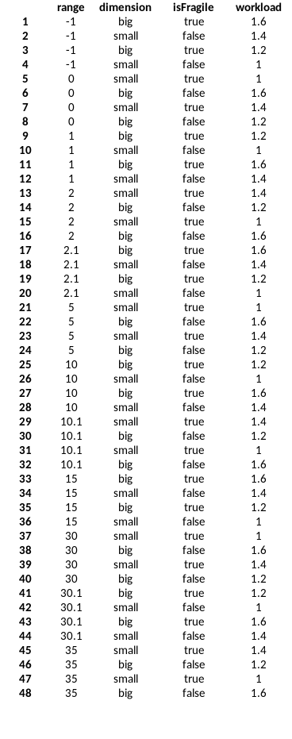

# Составление тестовых данных

Для покрытия было необходимо использовать следующие техники тест-дизайна:

* Доменное тестирование (Класс эквивалентности + Анализ граничных значений)
* Попарное тестирование
* Тестирование позитивных и негативных случаев

## Попарное тестирование

Сгенерирован набор через доступный ресурс: https://pairwise.teremokgames.com/:

Параметры, которые прикладывались:

| Расстояние | [Тип груза](../main/java/org/example/app/enums/DimensionType.java) | Хрупкость | [Загруженность службы доставки](../main/java/org/example/app/enums/WorkloadStatus.java) |
|------------|--------------------------------------------------------------------|-----------|-----------------------------------------------------------------------------------------|
| -1.0       | BIG                                                                | true      | VERY_HIGH                                                                               |
| 0.0        | SMALL                                                              | false     | HIGH                                                                                    |
| 1.0        |                                                                    |           | INCREASED                                                                               |
| 2.0        |                                                                    |           | DEFAULT                                                                                 |
| 2.1        |                                                                    |           |                                                                                         |
| 5.0        |                                                                    |           |                                                                                         |
| 10.0       |                                                                    |           |                                                                                         |
| 10.1       |                                                                    |           |                                                                                         |
| 15.0       |                                                                    |           |                                                                                         |
| 30.0       |                                                                    |           |                                                                                         |
| 31.0       |                                                                    |           |                                                                                         |
| 35.0       |                                                                    |           |                                                                                         |
